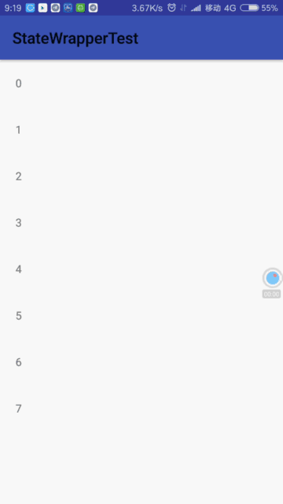

# StateWrapper 
#

## 1.概述
用于在recyclerview中设置显示状态（无数据、无网络等），之前写过一个设置多类型的adapter
包括状态，全部统一控制，设置状态还要清楚数据，做了一些无用功，而且不能扩展，不方便。

而这个adapter设置的size 就是1，不需要多元数据做任何操作，只有setShowStateView(isShow)
来控制显示就好，很方便，也不破坏原有的adapter

<br/>
<br/>
 

## 2.说明  
```
//-控件设置-
    // 设置状态view是否显示
   stateWrapper.setShowStateView(isShow)
    
```
